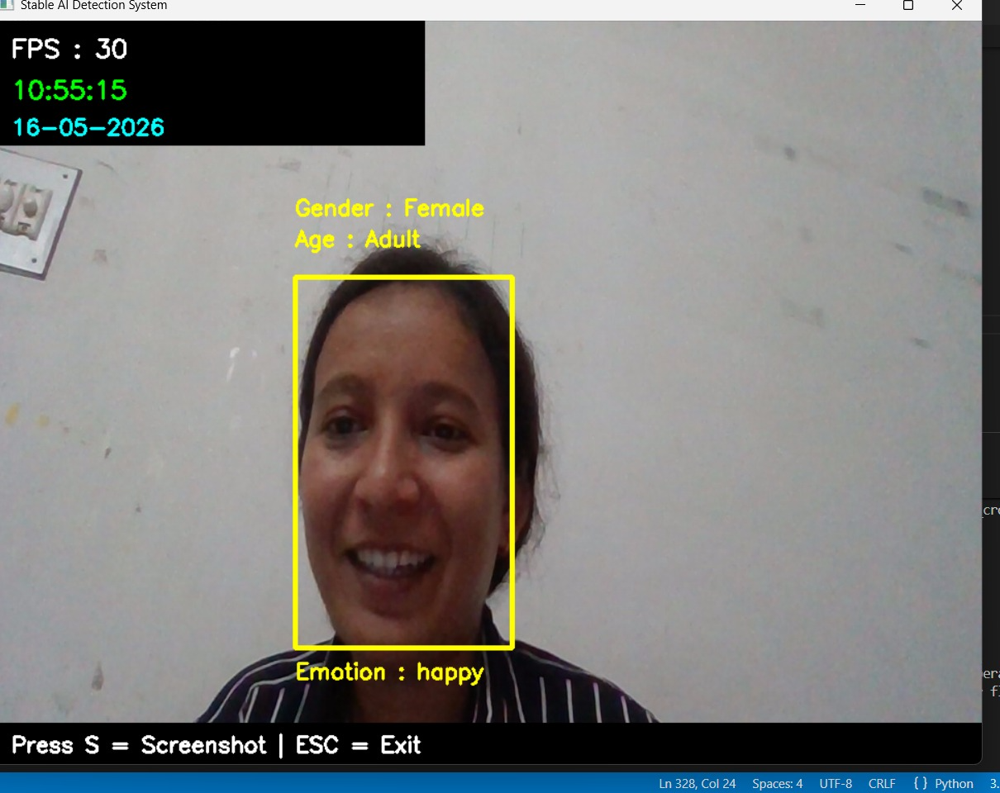
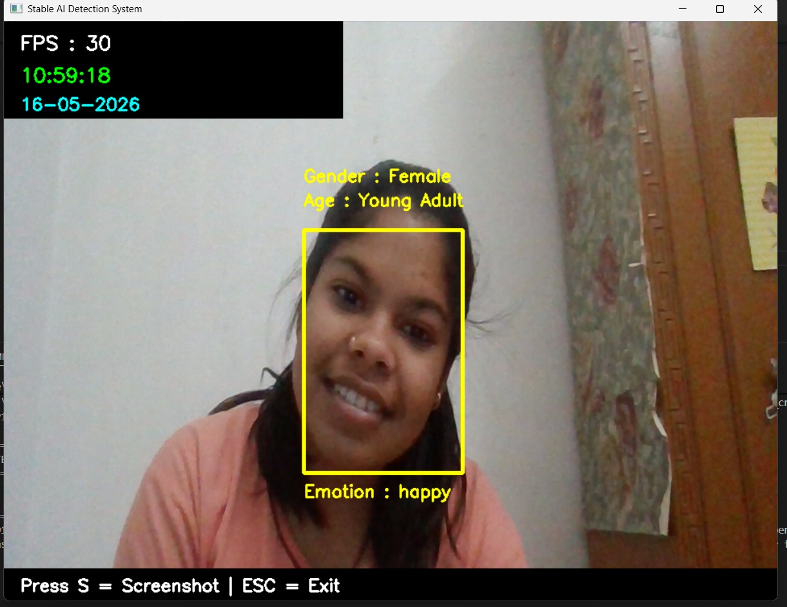

# 🎭 Gender Emotion Age Detection System

An AI-powered real-time detection system that identifies **Gender**, **Emotion**, and **Age Group** using a webcam or uploaded image/video. The project uses **Computer Vision**, **Deep Learning**, and **OpenCV** to analyze human faces and predict demographic and emotional information.

---

# ⚙️ Installation

## 1️⃣ Clone Repository

```bash
git clone https://github.com/your-username/Gender_Emotion_Age_System.git
cd Gender_Emotion_Age_System
```

---

## 2️⃣ Install Dependencies

```bash
pip install -r requirements.txt
```

---

# ▶️ Run Project

```bash
python main.py
```

---

# 🖥️ Output

The system detects:

* 👦 Gender
* 😊 Emotion
* 🎂 Age Group

in real-time from webcam feed.

---

# 📸 Sample Output



## Real-Time Detection

```text
Gender : Female
Emotion : Happy
Age : Adult
```

---

# 🧪 How It Works

1. Webcam captures live frames.
2. OpenCV detects human face.
3. Face region is preprocessed.
4. Deep learning models predict:

   * Gender
   * Emotion
   * Age
5. Results displayed on screen.

---

# 🚀 Future Enhancements

* Voice Emotion Detection
* Multi-face Tracking
* Attendance Integration
* Cloud Deployment
* Mobile App Version
* Emotion Analytics Dashboard

---

# 💡 Real World Applications

* Smart Surveillance Systems
* Human Behavior Analysis
* Retail Customer Analytics
* Mental Health Monitoring
* Smart Classrooms
* AI Interview Systems

---

# 🛠️ Requirements

```txt
opencv-python
numpy
tensorflow
keras
imutils
```

---

# 📈 Resume Description

Developed an AI-powered real-time Gender, Emotion, and Age Detection System using Python, OpenCV, and Deep Learning models. Implemented facial analysis with CNN-based classification to predict demographic and emotional attributes from webcam feed with high accuracy.

---

# 🤝 Contribution

Contributions are welcome.
Feel free to fork this repository and improve the project.

---

# 📧 Contact

👩‍💻 Komal Khatod
📩 [komalkhatod1234@gmail.com](mailto:komalkhatod1234@gmail.com)

---

#  If You Like This Project

Give this repository a ⭐ on GitHub.
